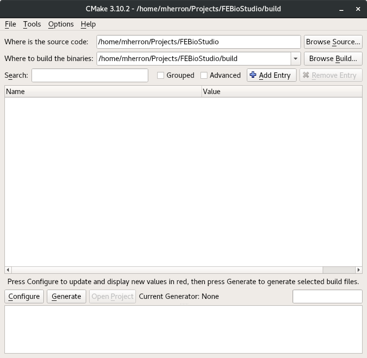
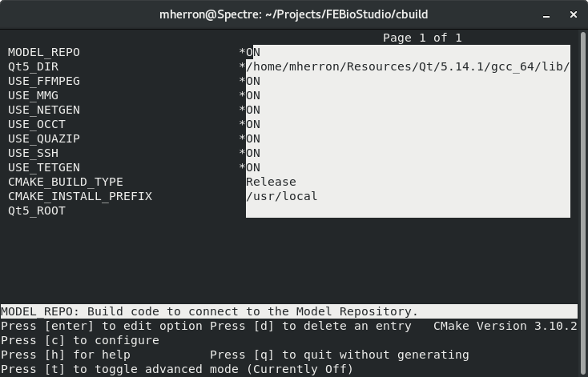
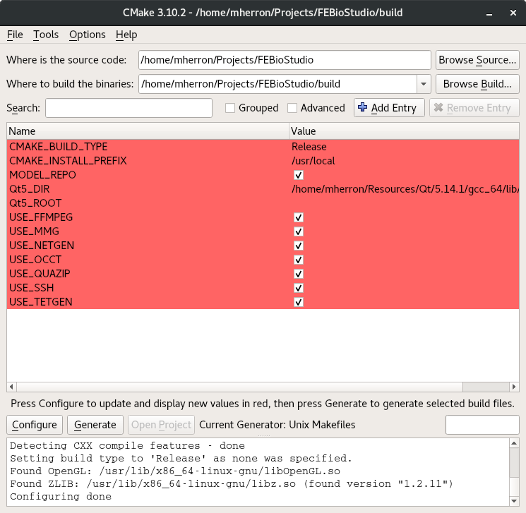

# FEBio Studio Build Guide

### Table of contents
- [Prerequisites](#prereq) 
- [Running CMake](#runCMake)
- [Building FEBio Studio](#build)
- [Limitations of CMake](#limits)
- [Troubleshooting](#trouble)

## Prerequisites <a name="prereq"></a>

### CMake 
FEBio Studio's build process utilizes CMake, an open-source, cross-platform tool designed to streamline the configuration of the build environment. The CMake script in this repository will help you to locate necessary third party libraries on your machine, set up include and library paths, and allow you to choose which of FEBio Studio’s features you would like to include in your build.

Please download the latest release of CMake from https://cmake.org/, and install it on your machine before proceeding. Many Linux distributions come with CMake pre-installed, or have CMake available through their package managers.

### FEBio
Since the release of version 2.0, FEBio Studio requires the FEBio SDK. The SDK can be downloaded as part of our FEBio Studio installers from [febio.org](https://www.febioorg/downloads), or you can build it yourself by cloning the [FEBio GitHub Repository](https://github.com/febiosoftware/FEBio), and following the [BUILD](https://github.com/febiosoftware/FEBio/blob/develop/BUILD.md) guide. 

### Qt

Qt is a cross-platform framework primarily used to create graphical user interfaces. Qt dependence is built into the large majority of FEBio Studio's code, and so it is absolutely required. A free, open-source version of Qt can be downloaded from [Qt's download page](https://www.qt.io/download). The Qt installer will allow you to choose many different versions of Qt, and individually decide which components of the version that you would like to install. 

FEBio Studio requires at least version 6.5.0 of Qt, and we recommend that you install version 6.8.0.

If you wish, you may install all of Qt's components, but doing so is not necessary. Only the following components are used by FEBio Studio:

* The "core" Qt component. The name of this component differs depending on your platform. 
    * On Windows, when compiling with Microsoft Visual Studio 2022 (which is highly recommended), this component is named _MSVC 2022 64-bit_.
    * On macOS, this component is named _macOS_.
    * On Linux, this component is named _Desktop_.
* The _Qt Charts_ component is used by FEBio Studio to create plots during post-simulation analysis.

### Other Required Third Party Packages

FEBio Studio relies on several third party packages. Some are required to compile FEBio Studio at all, while others are only required if you would like to include specific features in FEBio Studio. The following third party packages are required:

* OpenGL is a widely-used 2D and 3D graphics application programming interface. FEBio Studio uses OpenGL to render everything in the model view area. This library is generally pre-installed on all modern operating systems. Be sure to have your latest graphic driver installed. 

* GLEW is the OpenGL Extension Wrangler Library. FEBio Studio uses GLEW in various places in its graphics rendering code. The source for this library, and precompiled binaries for Windows can be found on [GLEW's Website](https://glew.sourceforge.net/). On macOS GLEW can be obtained via Homebrew, and on Linux it can usually be installed by the system's package manager. 

### Optional Third Party Packages

FEBio Studio makes use of the following third party packages to add additional functionality. If you do not need the functionality provided by a given package, you can still compile FEBio Studio without it. The libraries below are organized according to the type of functionality they add. 

#### Meshing

* TetGen is used by FEBio Studio for generating and remeshing tetrahedral meshes. To use this library, you will need to download the source and compile it yourself. The source for this library can be downloaded from [TetGen's website](http://wias-berlin.de/software/index.jsp?id=TetGen&lang=1).

* MMG is also used by FEBio Studio for remeshing tetrahedral meshes. Unlike TetGen, MMG does not generate an initial tetrahedral mesh, it only remeshes an existing mesh. MMG's remeshing process does, however, tend to produce a higher quality mesh than TetGen's. The _Tet Remesh_ tool in FEBio Studio relies on MMG. To use this library, you will need to download the source and compile it yourself. The source for this library can be downloaded from [MMG's GitHub account](https://github.com/MmgTools/mmg).

#### CAD Support

* Open CASCADE Technology (OCCT) is a software package used by FEBio Studio to import and create CAD objects. OCCT does not mesh CAD objects, and so is of little use without NetGen (see below). Instructions for installing the pre-compiled binaries on Windows, and a link to the source code for this package can be found on [Open CASCADE's website](https://old.opencascade.com/content/latest-release).

* NetGen is an automatic 3D tetrahedral mesh generator that is used by FEBio Studio to mesh CAD objects. NetGen depends on OCCT in order to compile and run, and so OCCT must be installed or compiled prior to compiling NetGen. The source code for this package can be found on [NetGen's GitHub page](https://github.com/NGSolve/netgen).

#### FEBio Project Repository  

* LibZip is a library used to create and read zip files. This library is required to use the features of FEBio Studio that interact with the FEBio Project Repository. The source can be found on [LibZip's website](https://libzip.org/).

* SQLite is an open-source library used for reading and writing data from self-contained SQL database files. FEBio Studio uses this library to store and retrieve information about the projects in the online FEBio Project Repository. SQLite is therefore required to use the repository. Many Linux distributions offer a version of SQLite through their package managers, however, FEBio Studio uses some relatively new SQLite features implemented in version 3.24.0. It is therefore recommended that SQLite be compiled from its source code. Instructions on how to compile SQLite, and a link to its source code can be found on [SQLite's website](https://sqlite.org/src/doc/trunk/README.md).

#### Remote FEBio Jobs

* libssh is used by FEBio Studio to run FEBio jobs on remote systems, and to send and retrieve the associated job files. There is another library called "libssh2", which is not a latter version of libssh, but rather a completely unrelated library; don't confuse the two. Instructions on how to install or compile libssh can be found on [their website](https://www.libssh.org/get-it/).

* OpenSSL is used by FEBio Studio to encrypt SSH passwords (for use in running remote jobs) while they are stored in RAM. Both libssh and OpenSSL are required for running remote FEBio jobs. Information on how to build this library can be found on [OpenSSL's website](https://www.openssl.org/source/). OpenSSL is also available on macOS through [Homebrew](https://brew.sh/).

#### Image Manipulation

* SimpleITk is a simplified interface to the Insight Toolkit (ITK), which is an industry-standard, multi-dimensional image analysis library. FEBio Studio requires SimpleITK to read and write various image formats, apply certain image filters, and perform certain image analyses. The source code can be downloaded from [SimpleITK's GitHub repository](https://github.com/SimpleITK/SimpleITK). 

#### Miscellaneous

* FFMPEG is used by FEBio Studio for creating MP4 recordings. FFMPEG is available through most Linux package managers, and through [Homebrew](https://brew.sh/) on macOS. Installation files, and the source code can also be found on [FFMPEG's website](https://ffmpeg.org/download.html).

* zlib is an open-source, lossless data-compression library that is used by FEBio Studio to read plot files that have been compressed. This library is generally pre-installed on macOS, and most Linux distributions. For Windows, you will need to download the latest source from [zlib's website](https://zlib.net/), and compile the library yourself. 

## Running CMake <a name="runCMake"></a>

CMake is used to configure the build environment for FEBio Studio on your machine. It can be used to generate a Microsoft Visual Studio Solution on Windows, an XCode Project on macOS, and a set of makefiles to be used with the GNU Make tool on Linux. 

CMake generates a large number of configuration files that can cause the build directory to become cluttered. It is therefore strongly recommended that you do an [out-of-source build](https://gitlab.kitware.com/cmake/community/-/wikis/FAQ#what-is-an-out-of-source-build) by pointing CMake to an empty directory. The _build_ directory in the FEBio Studio repository is provided for this purpose. If for some reason you find yourself needing to clear out your CMake configuration for FEBio Studio and start this process from scratch, all you will need to do is delete everything in that build directory.

### CMake GUI


<!--  -->

On Windows, and macOS CMake is run using the CMake graphical user interface (GUI). The CMake GUI is also available on Linux, but is generally installed separately, and so the command line interface (CLI) version, _ccmake_ is generally used (see below).

To start the configuration process, enter the path to the root directory of the FEBio Studio repository that you've downloaded onto your machine into the box labeled _Where is the source code:_. To insure that you are doing an out-of-source build, enter the path to the _build_ directory of your FEBio Studio repository in the box labeled _Where to build the binaries:_. You may also locate these directories using a file browser by clicking on the _Browse_ buttons to the right of these fields. 

### ccmake


<!--  -->

If you are running Linux and have not installed the CMake GUI, there are two ways to run cmake. You can run the command `cmake` which will call CMake and run through the configuration and generation processes automatically. This method, however does not allow for interactivity, and so it is highly recommended that you instead run the command `ccmake`. This will run an interactive version of CMake with an in-terminal GUI as shown above. Using ccmake should allow you to follow along with the rest of this tutorial. To start an out-of-source build with ccmake, open a terminal in the _build_ directory of your local copy fo the FEBio Studio repository and run the following command:

```
ccmake ..
```

### First Configuration

The configuration step in the CMake build process runs the script defined in `CMakeLists.txt` located in the root directory of the FEBio Studio repository. This script does several things: 

* Attempts to locate the FEBio SDK, Qt, and any other third party packages that FEBio Studio uses.
* Automatically enables or disables FEBio Studio features based on which libraries it was able to find.
* Automatically sets up include and library paths for your build system based on the libraries that it found, and the features that have been enabled.

To run the configuration process click the _Configure_ button in the lower left part of the GUI, or type `c` if you are using ccmake. If you are running the CMake GUI, you will be asked to choose a generator for the project. On Windows, choose the version of MSVC that you have installed and click _Finish_. On macOS, leave the default value and click _Finish_. CMake will now run the configuration process, the output of which can be seen in the text field at the bottom of the GUI. If all goes well, new fields will be added in red to the GUI, and it should look something like the image below:


<!--  -->

However, you may be greeted with a dialog saying that there was an error. If this is the case, you will find the error message in red text in the text field at the bottom of the GUI. The most common errors you will encounter on the first run will either say that CMake was unable to locate the FEBio SDK, or `Qt6Config.cmake`. If you run into another error at this point, see the Troubleshooting section.

#### Locating FEBio

The CMake script included in the FEBio Studio repository will do its best to locate Qt on your machine. If it is unable to locate Qt automatically, a simple mechanism is provided for you to help point it in the right direction. A variable called `FEBio_SDK` will have appeared in the CMake GUI. Enter the path to the root directory of either your local FEBio git repository, or the FEBio SDK as the value for the variable, then run the configuration step again. If you've correctly entered the path, it should find FEBio and present you with something more like what is in the image above.


#### Locating Qt

The CMake script included in the FEBio Studio repository will do its best to locate Qt on your machine. If it is unable to locate Qt automatically, a simple mechanism is provided for you to help point it in the right direction. A variable called `Qt_Root` will have appeared in the CMake GUI. Enter the path to the root directory of your Qt installation as the value for the variable, then run the configuration step again. If you've correctly entered the path, it should find Qt and present you with something more like what is in the image above.

### Build Options

After running the configuration process, the CMake GUI will populate with several build options that can be toggled on or off. Building FEBio Studio with a given build option enabled requires one or more of the optional third party packages to be installed on your machine and located by CMake. 

Build Option | Required Packages | Added Features
-------------|-------------------|---------------
CAD_FEATURES|OCCT<br>NetGen|Importing and meshing CAD objects
MODEL_REPO|LibZip<br>SQLite|Connecting to the online FEBio Project Repository
USE_FFMPEG|FFMPEG|Creating mp4 video recordings
USE_ITK|SimpleITK|Image analysis
USE_MMG|MMG|Advanced tetrahedral remeshing
USE_SSH|libssh<br>OpenSSL|Running FEBio jobs on remote servers
USE_TETGEN|TetGen|Tetrahedral remeshing

### Manually Locating Packages

If CMake is unable to find any of the third party packages on your system, it will automatically disable the corresponding build option. It will also make visible the fields for the include and library directory paths for the missing packages. In order to build with any of these options, you will need to manually edit the include and library directory paths for the required packages. The include path for a given package should point to the directory containing that package's header files, and the library path should point to the directory containing that package's compiled libraries. Once you have updated the paths for the required packages, you then need to manually toggle the option back on.

### Project Generation

Once the desired optional packages have been located, and their corresponding build options have been enabled, it is time to generate the platform-specific build files. It's always a good idea to run Configure one more time before you generate the build files. This will make sure that the CMakeLists script catches any errors that you may have introduced by manually changing paths, or toggling build options. Once you've run Configure again, click the _Generate_ button (or type `g` if you're using ccmake). On Windows this will generate a Visual Studio Project, on macOS this will generate an XCode Project, and on Linux this will generate a Makefile. If you're running Windows or macOS, you can click the _Open Project_ button and it will automatically open the created project. 

## Building FEBio Studio <a name="build"></a>

### Windows

Once you have the Visual Studio project open, you can choose whether you'd like to build a debug or a release version of the software, and then start the build process by either clicking on the Play button, or by pressing _F5_. After a successful build, the software should launch automatically. 

### macOS

Once you have the XCode project open, you'll want to change the build target from `ALL_BUILD` to `FEBioStudio`. Do this by clicking on the button that says `ALL_BUILD` in the upper left corner of XCode, next to the Play and Stop buttons. XCode will fully build FEBioStudio with either target selected, but this will ensure that XCode will automatically launch FEBioStudio after it's been built. Then you can start the build by either click on the Play button, or by pressing ⌘R. After a successful build, the software should launch automatically. 

### Linux

Once the Makefiles have been generated, open a terminal in the _build_ directory, and run `make`. If your machine has multiple cores, you can increase the speed of the build by passing a `-j` flag to _make_, followed by the number of threads you want _make_ to use (e.g. `make -j4`). Please note that this will only decrease the speed of the build, and will in no way affect the final binary. After a successful build, the compiled binary can be found in the _bin_ subdirectory.

## Limitations of CMake <a name="limits"></a>

CMake is a useful tool for automating cross-platform builds, but it is not without its limitations:

* CMake is unable to create project files or makefiles that can automatically detect the presence of new source files. If you update your local repository after a new FEBio Studio release, or if you modify FEBio Studio's source by adding new source files, you will have to rerun CMake in order to insure that any new source files are included in the build.

* On Linux, the type of build (e.g. debug, release, etc) is determined by CMake during the generation process, since the related options are baked into the resulting makefiles. To change the type of build you are building, you must rerun CMake and select the desired build type. 

## Troubleshooting <a name="trouble"></a>

* If you get errors that look something like this<br><br>`Could not find nglib.so, or nglib.a.  Check NETGEN_LIB_DIR`<br><br>This means that  CMake is unable to locate some of the libraries associated with a currently active build option. To fix this issue, ensure that the library directory for the related package contains all of the necessary libraries, and that the associated CMake variable is pointing to the correct directory. If CMake is still unable to find all of the required libraries, you may either have to rebuild or reinstall the third-party package, or disable the build option that uses it. 

* macOS ships with a version of libcrypto (required with the USE_SSH option). This version is signed in such a way that prevents the library from being used by most programs. If you try to link to this library, it will fail. Please ensure that the CMake variable SSL_LIB_DIR is not pointing to `/usr/lib`, or it will try to link with macOS's version of the library. 

* If you run into other issues while building FEBio Studio, please visit [our forums](https://forums.febio.org/) for more help.
